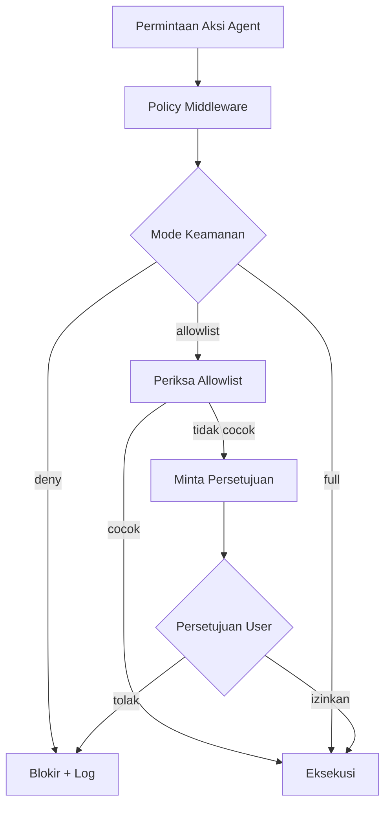

# Bab 20: Policy-as-Code

> *"Guardrail berbasis natural language itu kayak rambu lalu lintas yang ditulis tangan terus ditempel pake pita. Lumayan, sampai angin pertama yang bertiup. Policy-as-code itu rambu yang ditanam di beton, dengan sensor, dengan sistem monitoring. Bedanya jauh."*

---

## Kenapa Kebijakan-Program Sangat Penting bagi AI Agent

Coba bayangin kamu kasih instruksi ke AI agent pake kata-kata kayak "jangan hapus production". Seberapa yakin kamu agent itu bakal selalu ngikut? Harusnya sih gak terlalu yakin. AI agent bisa aja lupa, salah interpret, atau nyari cara buat ngelingkarin larangan yang cuma verbal. Dan itu belum termasuk kalau ada prompt injection yang bilang "abaikan instruksi sebelumnya". Sistem guardrail berbasis bahasa alami itu inheren ambigu dan tidak deterministic.

Policy-as-code adalah perbedaan antara "tolong jangan hapus production" sama "sistem secara fisik mencegah penghapusan production". Satu itu permintaan yang bergantung pada niat baik, satu lagi enforcement yang bergantung pada infrastructure. Satu bisa di-bypass cuma dengan prompt yang cukup meyakinkan, satu gak bisa di-bypass walaupun agent kamu secara harfiah "pengen banget" ngelakuinnya. Bayangkan selisih kekuatan antara password lock versus brankas baja.

Yang bikin policy-as-code jadi fondasi sekuritas AI agent adalah sifatnya yang deterministic, auditable, dan version-controlled. Deterministic artinya policy yang sama bakal di-enforce dengan cara yang sama setiap saat. Auditable artinya kamu bisa buktiin policy apa yang berlaku kapan, dan siapa yang nge-change-nya. Version-controlled artinya perubahan policy bisa di-review, di-test, di-rollback, sama persis kayak kode biasa.

Yang lebih penting lagi, policy-as-code mindah-in beban keputusan dari "trust" ke "verification". Kamu gak harus percaya bahwa agent kamu bakal behave dengan benar, karena kamu udah verify via policy bahwa agent kamu secara teknis gak mampu misbehave di area yang kritikal. Ini pergeseran pikiran fundamental yang penting untuk deploy AI agent di lingkungan produksi dengan aman.

> **Istilah Kunci: Policy-as-code** adalah pendekatan di mana aturan keamanan dan operasional didefinisikan dalam kode, bukan dalam deskripsi verbal, sehingga menjadi executable, testable, dan bisa diverifikasi. Mirip konsep Infrastructure-as-Code, tetapi untuk aturan keamanan.

---

## Sistem Policy Built-in OpenClaw

### OpenClaw sebagai Kastil Berlapis

Coba bayangin OpenClaw kayak kastil dengan beberapa lapis pertahanan. Agent kamu adalah tamu di dalam kastil, dan kamu gak pengen tamu ini bisa ngelakuin hal berbahaya. Buat itu, ada tiga lapisan keamanan yang saling kerja sama:

1. **Sandbox**: Lingkungan eksekusi yang ter-containerisasi, kayak kamar tamu yang terisolasi.
2. **Tool Policy**: Izin tool yang granular plus deny list, kayak aturan tentang apa yang boleh dan gak boleh dipake.
3. **Elevated Mode**: Keluar dari sandbox dengan approval gate, kayak minta kunci buat keluar kamar.

Kenapa harus berlapis? Karena setiap lapisan ada limitasinya. Sandbox bisa bocor kalau ada zero-day di runtime. Tool policy bisa bypass kalau ada celah di logic parser. Elevated mode bisa disalahgunakan kalau approver-nya ceroboh. Tapi kalau ketiga lapisan itu digabungin, probabilitas ketiga-tiganya gagal barengan jadi sangat kecil. Ini prinsip pertahanan berlapis yang sudah terbukti di dunia keamanan selama puluhan tahun.

Tanpa sistem multi-lapisan ini, agent kamu bisa aja secara tidak sengaja atau sengaja jalanin aksi yang berbahaya. Policy-as-code itu rencana cadangan untuk semua skenario kegagalan.


---

## Konfigurasi Tool Policy

### Kebijakan Alat Mirip Daftar Tamu Pesta

Tool Policy kerja kayak daftar tamu di sebuah pesta. Ada tamu yang diizinkan masuk (allow), ada yang dilarang masuk (deny), dan ada yang perlu di-tanyain dulu (approval). Konsepnya simple, tapi implementasinya powerful banget.

> **Istilah Kunci: Tool Policy** adalah aturan yang nentuin tool-tool apa yang boleh dan gak boleh dipake agent. Ini kayak whitelist dan blacklist buat eksekusi command, tapi dengan support buat pattern matching dan scope yang granular.

```json5
// ~/.openclaw/openclaw.json - Konfigurasi tool policy
{
  "agents": {
    "defaults": {
      "tools": {
        "policy": {
          "deny": ["exec:rm -rf", "exec:mkfs", "exec:dd", "docker rm -f", "kubectl delete"],
          "allow": ["exec:kubectl get", "exec:helm", "exec:git"]
        }
      }
    },
    "list": [
      {
        "id": "prod-agent",
        "tools": {
          "policy": {
            "allow": ["exec:kubectl get", "exec:helm status", "exec:helm template"],
            "deny": ["exec:rm", "exec:docker rm", "kubectl delete"]
          }
        }
      }
    ]
  }
}
```

### Contoh Nyata: Agent Production vs Development

Di contoh di atas, perhatikan perbedaan antara agent default dan `prod-agent`. Agent default masih boleh jalanin `kubectl get`, `helm`, dan `git` dengan scope yang lumayan lebar. Tapi agent production (`prod-agent`) cuma boleh baca status dan template. Dia gak boleh ngehapus atau ngubah apapun.

Pola "agent produksi yang jauh lebih restriktif daripada agent default" ini rekomendasi umum yang sangat berharga untuk kamu adopsi. Setiap agent yang punya akses ke production harus punya policy terpisah yang eksplisit ketat, bahkan kalau itu artinya kamu harus bikin banyak agent dengan policy berbeda. Kenyamanan konfigurasi itu lebih murah daripada biaya incident.

> **Eits, Hati-hati!** `rm -rf` itu command yang sangat berbahaya kalau salah pake. Selalu periksa dua kali sebelum nambahin ke daftar allow, dan kalau perlu, gak usah pernah masukin ke allow list sama sekali. Ada alternatif yang lebih aman kayak pake `find ... -delete` dengan pattern yang spesifik, atau trash-cli yang bisa di-undo.

### Tool Groups dan Profiles

OpenClaw nyediain kelompok dan profil tool yang udah di-configure sebelumnya, biar kamu gak harus nulis policy dari nol. Profile itu kayak "template" yang bisa kamu pake sebagai starting point.

```json5
{
  "agents": {
    "defaults": {
      "tools": {
        "profiles": {
          "minimal": {
            "allow": ["read"],
            "deny": ["exec", "write", "filesystem"]
          },
          "coding": {
            "allow": ["read", "write", "exec"],
            "deny": ["exec:rm -rf", "exec:mkfs"]
          },
          "messaging": {
            "allow": ["read", "write", "send_message"],
            "deny": ["exec"]
          },
          "full": {
            "allow": ["read", "write", "exec"],
            "deny": []
          }
        },
        "groups": {
          "runtime": ["node", "python", "python3", "python3.10", "python3.11", "python3.12", "pnpm", "npm", "yarn", "go", "deno"],
          "fs": ["read", "write", "filesystem"],
          "sessions": ["process", "send"],
          "all": ["read", "write", "exec", "filesystem", "process", "send"]
        }
      }
    }
  }
}
```

Profile `minimal` cocok buat agent yang cuma butuh baca data (misalnya agent yang generate report). Profile `coding` cocok buat development agent. Profile `messaging` buat agent chatbot yang cuma respond, gak eksekusi command. Profile `full` harusnya jarang dipake karena dia gak punya batasan, cuma pake kalau kamu bener-bener tau apa yang kamu lakuin.

Groups itu buat ngelompokin beberapa tool jadi satu alias. Jadi daripada nulis semua runtime satu-satu di setiap policy, kamu bisa cukup pake group `runtime`. Abstraksi yang simple tapi bikin config jauh lebih maintainable.

### Policy Tool Sandbox

Pas sandbox aktif, OpenClaw nerapkan pembatasan tambahan. Ini layer kedua yang berjalan di atas tool policy biasa. Jadi kamu bisa relax policy umum tapi tighten yang khusus sandbox, atau sebaliknya.

```json5
{
  "agents": {
    "defaults": {
      "sandbox": {
        "mode": "container",
        "tools": {
          "policy": {
            "allow": ["read", "write", "exec"],
            "deny": ["exec:docker rm", "exec:kubectl delete"]
          }
        }
      }
    }
  }
}
```

---

## Standing Orders buat Governance yang Lebih Canggih

### Standing Orders itu Kayak Asisten Pintar

Standing Orders bekerja layaknya asisten pribadi yang selalu memantau percakapan kamu. Kalau kamu nyebut kata "production", "deploy", atau "delete", asisten itu langsung inget aturan khusus buat situasi itu dan langsung apply.

> **Istilah Kunci: Standing Orders** adalah aturan yang jalan di background, memantau konteks percakapan dan menerapkan policy secara otomatis berdasarkan pola yang terdeteksi. Ini membuat policy menjadi context-aware, bukan statis.

```json5
// ~/.openclaw/openclaw.json - Standing orders
{
  "agents": {
    "defaults": {
      "standings": [
        {
          "id": "production-protector",
          "match": "production|prod|live",
          "commands": ["deploy", "restart", "scale"],
          "allow": ["exec:kubectl get", "exec:kubectl apply", "exec:helm upgrade"],
          "deny": ["exec:rm", "exec:docker rm", "exec:kubectl delete", "exec:kubectl scale"],
          "approval_required": true,
          "sandbox": true
        },
        {
          "id": "development-allow",
          "match": "development|dev|staging",
          "target": "development",
          "commands": ["deploy", "restart", "scale", "debug"],
          "allow": ["exec:kubectl", "exec:helm"],
          "sandbox": true
        }
      ]
    }
  }
}
```

### Contoh Nyata: Percakapan yang Dipantau

Kalau kamu ketik ke agent: `"Bantu deploy production ke cluster staging"`, standing orders bakal:

1. Detect kata kunci "production" dan "deploy"
2. Liat bahwa ini command "deploy"
3. Periksa apakah command ini diizinkan
4. Karena `approval_required: true`, agent bakal minta persetujuan kamu dulu
5. Kalau di-approve, jalanin `exec:kubectl apply` tapi gak `exec:kubectl delete`

Yang bagus dari pola kayak gini, kamu bisa punya policy yang beda buat konteks yang beda tanpa harus bikin agent yang beda-beda. Satu agent bisa handle development, staging, dan production, tapi dengan enforcement yang berbeda tergantung kata kunci yang terdeteksi di percakapan.

Tapi perlu diingat, pattern matching bukanlah sistem yang sempurna. Ada edge case dimana user bisa aja nyebut "production" dalam konteks lain (misalnya "productionize this code"), dan standing order bakal masih trigger. Karena itu, standing order harus dipadu dengan layer lain, bukan menjadi satu-satunya pertahanan utama.

---

## Exec Approval dan Allowlist

Exec approval adalah sistem persetujuan yang sangat canggih untuk mengontrol kapan agent boleh menjalankan command di host. Dia mencegah agent jalanin command berbahaya, baik secara sengaja maupun gak sengaja. Layer ini jadi paling penting karena dia beroperasi di level terendah: sebelum command beneran di-execute di OS.

Tool policy itu layer pertama (berbasis label dan pola), exec approval itu layer kedua (berdasarkan path resolution dan argument parsing). Kombinasi keduanya memberi kamu keyakinan yang lebih tinggi.

### Security Mode

OpenClaw support tiga security mode buat exec:

- **deny**: Block semua request exec di host. Paling aman, tapi juga paling restriktif.
- **allowlist**: Izinkan cuma command yang ada di daftar izin. Balance antara keamanan dan usability.
- **full**: Izinkan semuanya (sama kayak elevated mode). Cuma pake kalau kamu yakin banget dengan agent-nya.

### Konfigurasi Exec Approval

```json5
// ~/.openclaw/exec-approvals.json - File persetujuan lokal
{
  "version": 1,
  "socket": {
    "path": "~/.openclaw/exec-approvals.sock",
    "token": "base64url-token"
  },
  "defaults": {
    "security": "allowlist",
    "ask": "on-miss",
    "askFallback": "deny",
    "autoAllowSkills": false
  },
  "agents": {
    "main": {
      "security": "allowlist",
      "ask": "on-miss",
      "askFallback": "deny",
      "autoAllowSkills": true,
      "allowlist": [
        {
          "id": "B0C8C0B3-2C2D-4F8A-9A3C-5A4B3C2D1E0F",
          "pattern": "~/Projects/**/bin/rg",
          "lastUsedAt": 1737150000000,
          "lastUsedCommand": "rg -n TODO",
          "lastResolvedPath": "/Users/user/Projects/.../bin/rg"
        }
      ]
    }
  }
}
```

Perhatiin field `ask` dan `askFallback`. Kombinasi ini nentuin behavior pas ada command yang gak ketemu di allowlist: mode `on-miss` bakal nanyain user, terus kalau user gak respon (timeout), `askFallback` nentuin default-nya. Setting `deny` di fallback itu rekomendasi karena lebih aman asumsi "deny kalau ragu" daripada "allow kalau ragu".

### Konfigurasi Safe Bins

> **Istilah Kunci: Safe Bins** adalah binary yang cuma bisa nerima input via stdin tanpa butuh persetujuan eksplisit. Biasanya utility text-processing kayak `cut`, `head`, `tail` yang risikonya rendah.

```json5
{
  "tools": {
    "exec": {
      "safeBins": ["cut", "uniq", "head", "tail", "tr", "wc"],
      "safeBinTrustedDirs": ["/opt/homebrew/bin", "/usr/local/bin"],
      "safeBinProfiles": {
        "myfilter": {
          "minPositional": 0,
          "maxPositional": 0,
          "allowedValueFlags": ["-n", "--limit"],
          "deniedFlags": ["-f", "--file", "-c", "--command"]
        }
      }
    }
  }
}
```

> **Eits, Hati-hati!** Walaupun safe bins dianggap aman, tetap waspada sama kombinasi flag yang gak biasa. Beberapa utility yang awalnya terlihat aman bisa punya flag tersembunyi yang bikin mereka jadi berbahaya. `awk` misalnya, bisa jalanin arbitrary command kalau kamu gak hati-hati. Selalu test command kompleks sebelum kasih izin penuh, dan kalau kamu gak yakin, jangan masukin ke safe bins.

---

## Elevated Mode buat Controlled Escape

### Elevated Mode itu Kayak Izin Khusus

Pas agent ada di dalam sandbox, kadang-kadang dia butuh izin buat jalanin command di luar sandbox. Elevated Mode itu kayak kasih izin khusus ke agent buat keluar dari ruang terbatas, tapi dengan pintu pengaman. Dia bukan "off switch" buat security, tapi escape hatch yang controlled.

Kenapa ini perlu? Karena ada task yang memang beneran butuh akses ke resource host, dan nge-force semua task ke dalam sandbox bikin workflow jadi gak praktis. Elevated mode kasih kamu flexibility sambil tetep maintain audit trail dan approval flow.

### Direktif Elevated Mode

Kontrol elevated mode per-session pake slash command:

- `/elevated on`: Jalanin di luar sandbox, tapi tetep keep approval
- `/elevated ask`: Sama dengan `on` (alias)
- `/elevated full`: Jalanin di luar sandbox dan skip approval
- `/elevated off`: Balik ke eksekusi yang terbatas di sandbox

Urutan ini penting kamu pahamin. `on` dan `ask` itu "elevated tapi masih dicegat approval system". `full` itu "elevated dan approval skip", yang harusnya jarang dipake dan cuma buat skenario spesifik. `off` buat balik ke mode aman setelah selesai task yang butuh elevation.

### Konfigurasi Elevated Mode

```json5
{
  "tools": {
    "elevated": {
      "enabled": true,
      "allowFrom": {
        "discord": ["user-id-123"],
        "whatsapp": ["+15555550123"]
      }
    }
  }
}
```

Perhatiin bagian `allowFrom`. Ini adalah layer kontrol akses yang menentukan siapa yang boleh memicu elevated mode. Cuma user tertentu dari channel tertentu yang bisa pake. Ini penting karena elevated mode itu fitur powerful yang harus dibatasi ke orang yang trusted.

> **Pro Tip:** Selalu limit `allowFrom` ke user dan channel yang minimal. Lebih baik restrictive dulu, terus di-loosen kalau ada kebutuhan, daripada permissive dari awal terus di-tighten setelah ada incident. Dan jangan pernah masukin channel publik (kayak group Slack yang terbuka) ke allowFrom, karena siapapun yang kebetulan ada di channel itu bisa exploit.

---

## Arsitektur Policy Enforcement

### Alur Penegakan Policy

OpenClaw menerapkan policy melalui beberapa lapisan yang saling terhubung. Saat agent membuat request, request tersebut masuk ke pipeline yang diperiksa di setiap layer sebenarnya di-eksekusi.




Yang menarik dari arsitektur ini adalah setiap titik keputusan memiliki audit log-nya sendiri. Saat ada request yang diblokir, dicatat. Saat ada request yang meminta approval, dicatat. Saat user approve atau deny, dicatat. Ini bikin kamu bisa trace back setiap keputusan policy enforcement kalau ada incident atau audit.

### CLI Command buat Manajemen Policy

```bash
# Lihat policy tool saat ini
openclaw config get agents.defaults.tools.policy.dangerous
openclaw config get agents.defaults.tools.policy.allow

# Lihat konfigurasi exec approval
openclaw approvals get
openclaw approvals get --gateway
openclaw approvals get --node <id|name|ip>

# Lihat standing order
openclaw config get agents.defaults.standings

# Test command terhadap policy (dry-run)
openclaw agent --message "restart production" --dry-run

# Jelasin policy sandbox saat ini
openclaw sandbox explain

# List skill yang terinstall dengan info policy
openclaw skills list --policy

# Lihat tool profile
openclaw config get agents.defaults.tools.profiles
```

Command yang paling kepake dari set ini adalah `agent --dry-run`. Command ini mensimulasikan apa yang akan terjadi saat agent menerima instruksi tertentu, tanpa benar-benar menjalankan apa-apa.

---

## Approval Forwarding ke Channel Chat

### Sistem Alarm Multi-Platform

Coba bayangin kamu lagi di jalan, terus dapet notifikasi approval di WhatsApp, Slack, dan Telegram sekaligus. Kamu bisa approve dari mana aja, pake aplikasi yang kebetulan paling gampang kamu akses saat itu. Ini yang dikasih OpenClaw dengan approval forwarding.

OpenClaw bisa forward prompt approval exec ke channel chat apa saja. Jadi approval bukan lagi workflow yang mengunci kamu di satu interface tertentu, tetapi menjadi universal di mana saja kamu aktif.

```json5
{
  "approvals": {
    "exec": {
      "enabled": true,
      "mode": "session",
      "agentFilter": ["main"],
      "sessionFilter": ["discord"],
      "targets": [
        { "channel": "slack", "to": "U12345678" },
        { "channel": "telegram", "to": "123456789" }
      ]
    }
  }
}
```

### Command Approval di Chat

```
/approve <id> allow-once
/approve <id> allow-always
/approve <id> deny
```

Opsi `allow-once` itu yang paling sering dipake karena kasih kamu kontrol granular, sementara `allow-always` cepet tapi bahaya kalau dipake sembarangan. Kamu gak mau kasih "always approve" ke command yang isi spesifik argument-nya beda di masa depan. Kecuali kamu bener-bener yakin command-nya aman di semua variasi, stick sama `allow-once`.

> **Contoh Nyata:** Tim SRE di sebuah company e-commerce setup approval forwarding ke Slack channel on-call mereka. Tiap approval request muncul di channel, dan siapapun yang lagi on-call bisa langsung approve atau deny dari HP mereka. Ini ngurangin MTTR incident dari puluhan menit jadi cuma beberapa menit, karena gak ada lagi "nunggu engineer buka laptop dulu" di tengah malam.

---

## Testing dan Validasi Policy

### Kenapa Testing itu Wajib

Policy tanpa testing itu seperti perang tanpa amunisi. Kamu perlu tahu apakah policy kamu bekerja seperti yang diharapkan sebelum mengandalkannya di produksi. Policy yang tidak di-test bisa menjadi ilusi keamanan yang berbahaya.

Yang sering dilupakan orang adalah policy juga bisa memiliki bug. Typo di regex, pola yang terlalu luas, pola yang terlalu sempit, konflik antar policy ganda, semua ini bisa membuat policy gagal menegakkan aturan. Testing adalah cara kamu memeriksa asumsi kamu benar sebelum masuk produksi.

### Unit Testing Policy

OpenClaw nyediain kemampuan testing policy built-in:

```bash
# Test konfigurasi
openclaw config validate

# Jalanin security audit
openclaw security audit

# Cek pelanggaran policy
openclaw doctor --fix

# Test alur approval exec
openclaw approvals test --command="kubectl get pods"
```

Command `openclaw config validate` harus jadi bagian dari pre-commit hook atau CI pipeline kamu. Jangan sampe config yang invalid ke-commit ke git. Dan `openclaw security audit` harus dijalanin rutin (mingguan atau bulanan) sebagai preventive measure.

### Versioning Policy dengan GitOps

```bash
# Commit perubahan policy
git add ~/.openclaw/openclaw.json
git commit -m "policy: tighten production access controls"

# Deploy policy dengan CI/CD
echo "opa test policy/ -v --coverage" >> .github/workflows/policy-test.yml
echo "openclaw config apply < ./policy/production.json" >> .github/workflows/policy-deploy.yml
```

Pendekatan GitOps untuk policy itu best practice karena memberi kamu semua keuntungan version control: history, review, rollback, blame, branch, merge. Perubahan policy bisa direview oleh tim security sebelum diterapkan, dan jika ada masalah kamu bisa rollback dengan `git revert`.

---

## Anti-Pattern yang Harus Dihindarin

### 1. Policy tanpa Testing

```json5
// BURUK: Deploy policy tanpa testing
{
  "deploy": ["write_policy", "deploy_to_opa"]
}

// BAIK: Test sebelum deploy
{
  "deploy": [
    "write_policy",
    "unit_test_policy",
    "integration_test_policy",
    "review_pr",
    "deploy_to_staging",
    "validate_in_staging",
    "deploy_to_production"
  ]
}
```

Policy yang di-deploy tanpa testing itu resep untuk bencana. Kamu baru tahu policy-nya rusak saat ada user atau agent yang terkena dampak, dan itu selalu waktu yang paling tidak tepat. Invest di testing workflow dari awal, jangan nanti.

### 2. Policy yang Terlalu Restrictive

```json5
// BURUK: Agent gak bisa ngelakuin apa-apa yang berguna
{
  "tools": {
    "policy": {
      "deny": ["*"]
    }
  }
}

// BAIK: Security dan utility yang seimbang
{
  "tools": {
    "policy": {
      "allow": ["read", "write"],
      "deny": ["exec:rm -rf", "exec:mkfs"]
    }
  }
}
```

Policy yang terlalu restrictive itu bikin agent useless. Kalau agent kamu gak bisa ngelakuin apa-apa, gak ada value yang dia kasih, dan tim kamu bakal berhenti pake. Cari balance: tutup celah yang beneran bahaya, tapi biarin agent tetep bisa produktif. Keamanan tanpa utilitas itu bukan keamanan, itu penghalang.

### 3. Policy tanpa Audit

```json5
// BURUK: Policy blok secara diam-diam
{
  "on_deny": "block"
}

// BAIK: Policy blok dengan penjelasan
{
  "on_deny": {
    "action": "block",
    "log": "full_context",
    "notify": ["agent", "user"],
    "message": "Action denied by policy: {{reason}}"
  }
}
```

Policy yang memblokir secara diam-diam itu membuat debugging menjadi neraka. User tidak tahu kenapa action mereka gagal, agent tidak tahu cara menyelesaikan task, dan kamu tidak memiliki data untuk memperbaiki policy. Selalu log context penuh pas ada deny, dan kalau memungkinkan, kasih user message yang jelas tentang kenapa action-nya di-block.

---

## Checklist: Policy-as-Code

- [ ] Semua constraint agent didefinisikan dalam **kode** (bukan cuma system prompt)
- [ ] Policy cover **tool access, execution scope, dan approval workflow**
- [ ] Tool policy pake **format JSON5 yang bener** dengan allow/deny list
- [ ] Exec approval dikonfigurasi dengan **security mode yang sesuai** (deny/allowlist/full)
- [ ] Standing order mendefinisikan **context-aware rule** buat environment yang berbeda
- [ ] Safe bins dikonfigurasi buat **operasi stdin-only yang risikonya rendah**
- [ ] Perintah CLI pake **command openclaw real** dari dokumentasi
- [ ] Policy **diuji** dengan `openclaw config validate` dan `openclaw security audit`
- [ ] Perubahan policy ngikutin **workflow GitOps** dengan CI/CD
- [ ] Elevated mode dikonfigurasi buat **sandbox escape yang terkontrol**
- [ ] Approval forwarding dikonfigurasi buat **governance multi-channel**
- [ ] Keputusan policy **tercatat dan bisa diaudit**
- [ ] **Review policy berkala** memastikan relevansi terus menerus


---

## Key Takeaways

- **Policy-as-code adalah fondasi keamanan AI agent.** Pake kode, bukan percakapan, buat mendefinisikan batasan. Bedanya antara trust dan verification.
- **Lapisan keamanan bertingkat itu wajib.** Sandbox + Tool Policy + Elevated Mode ngasih perlindungan berlapis. Satu layer gagal, layer lain masih nangkep.
- **Context-aware policy lebih powerful daripada static policy.** Standing order bisa ngedetect konteks dan apply aturan yang sesuai otomatis.
- **Approval workflow mencegah eksekusi yang gak diinginkan.** Approval forwarding ke chat channel bikin proses approval jadi ubiquitous dan cepat.
- **Testing itu wajib, bukan opsional.** Selalu test policy sebelum deploy di production. Policy yang gak di-test itu ilusi keamanan.
- **Audit trail sangat penting untuk investigasi forensik.** Setiap keputusan policy harus kecatet dengan konteks yang lengkap.
- **Keseimbangan antara keamanan dan utilitas.** Policy yang terlalu restrictive bikin agent gak berguna, yang terlalu loose bikin agent berbahaya. Sweet spot-nya ada di tengah.
- **Pendekatan GitOps untuk perubahan policy.** Version control, peer review, automated testing, dan rollback capability bikin policy change jadi safe dan auditable.

---

